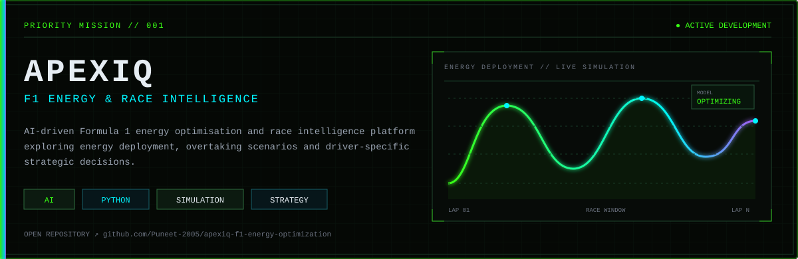
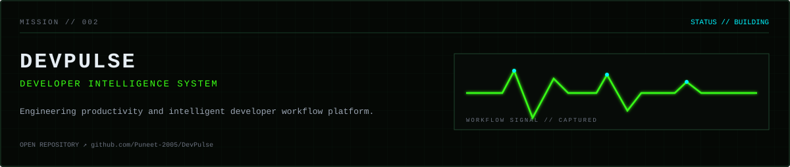
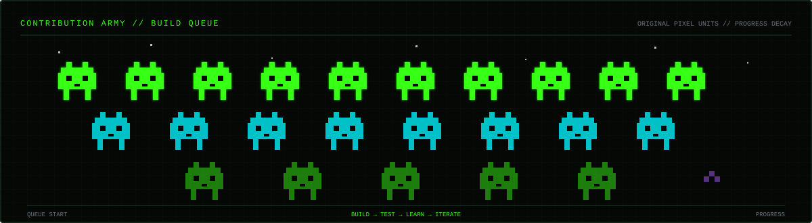

  

  

  

  

  

  
  

  

<picture>
  <source media="(prefers-color-scheme: dark)" srcset="https://raw.githubusercontent.com/Puneet-2005/Puneet-2005/output/github-contribution-grid-snake-dark.svg" />
  <source media="(prefers-color-scheme: light)" srcset="https://raw.githubusercontent.com/Puneet-2005/Puneet-2005/output/github-contribution-grid-snake.svg" />
  
</picture>

  

  

  <a href="https://github.com/Puneet-2005"><code>GITHUB // @Puneet-2005</code></a>
  &nbsp;&nbsp;·&nbsp;&nbsp;
  <code>EMAIL // NOT PUBLIC</code>
  &nbsp;&nbsp;·&nbsp;&nbsp;
  <code>LINKEDIN // URL PENDING</code>

  

<!--
  Contact channels intentionally avoid guessed personal details.
  Replace EMAIL // NOT PUBLIC and LINKEDIN // URL PENDING when public URLs are available.
-->
