

  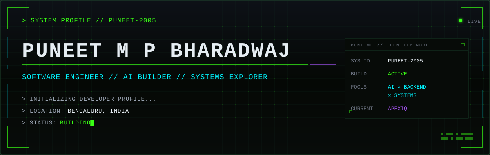

  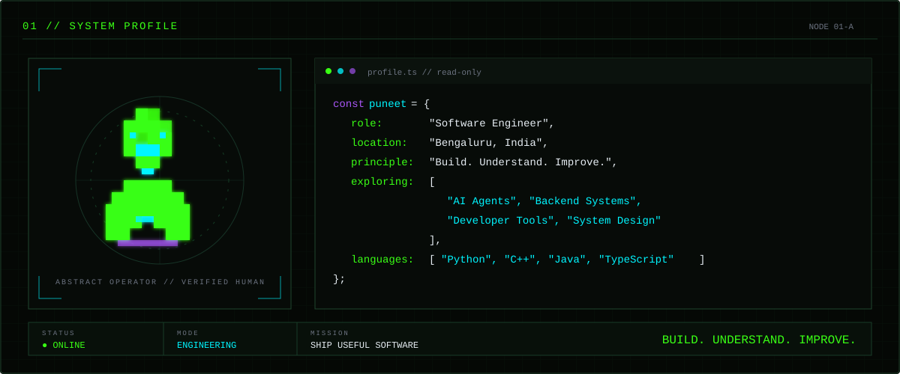

  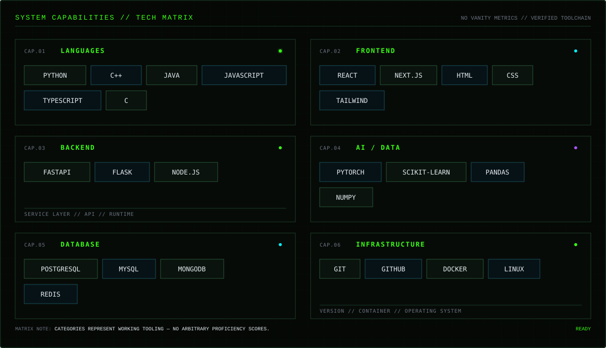

  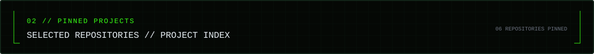

<a href="https://github.com/Puneet-2005/personal-finance-dashboard">
  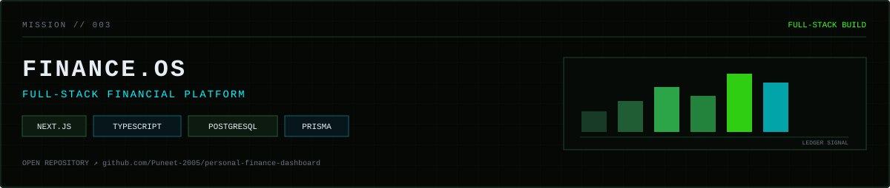
</a>

<a href="https://github.com/Puneet-2005/Real-Time-Data-Architecture-Design">
  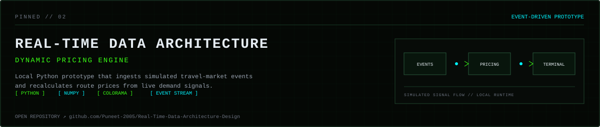
</a>

<a href="https://github.com/Puneet-2005/incident-response-agent">
  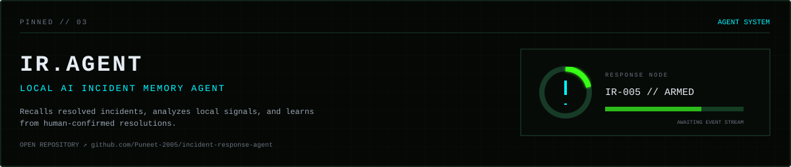
</a>

<a href="https://github.com/Puneet-2005/youtube-sumerization-ollama">
  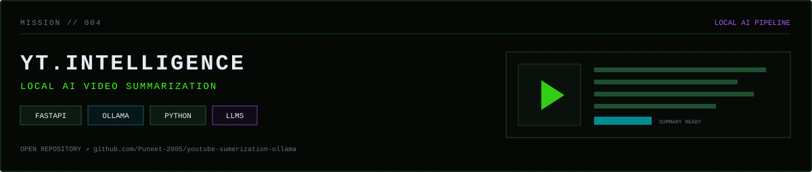
</a>

<a href="https://github.com/Puneet-2005/web-pade-cyber-city-">
  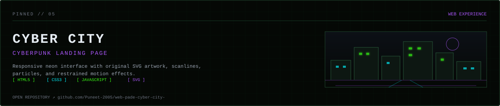
</a>

<a href="https://github.com/Puneet-2005/ClickHouse">
  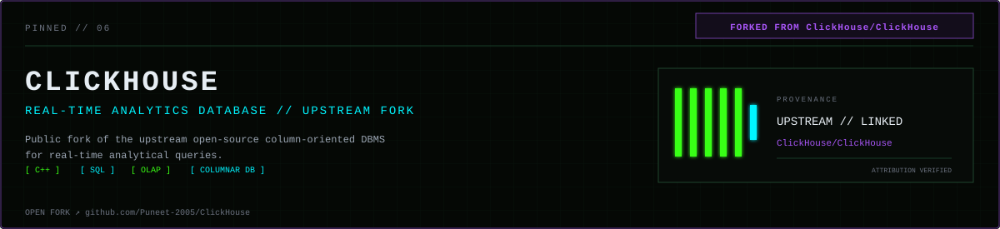
</a>

<!-- Replace generic Chess.com play link with personal chess profile later if desired -->
<a href="https://www.chess.com/play/online">
  
</a>
<!-- Future option: integrate a GitHub Actions-powered README chess implementation without client-side JavaScript. -->

  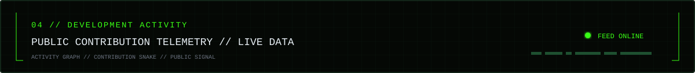

  

<picture>
  <source media="(prefers-color-scheme: dark)" srcset="https://raw.githubusercontent.com/Puneet-2005/Puneet-2005/output/github-contribution-grid-snake-dark.svg" />
  <source media="(prefers-color-scheme: light)" srcset="https://raw.githubusercontent.com/Puneet-2005/Puneet-2005/output/github-contribution-grid-snake.svg" />
  
</picture>

  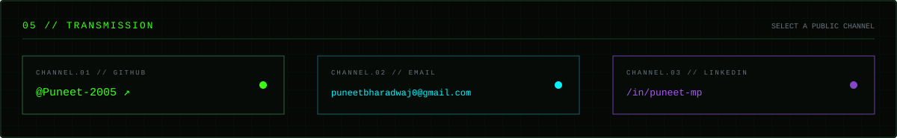

  <a href="https://github.com/Puneet-2005"><code>GITHUB // @Puneet-2005</code></a>
  &nbsp;&nbsp;·&nbsp;&nbsp;
  <a href="mailto:puneetbharadwaj0@gmail.com"><code>EMAIL // puneetbharadwaj0@gmail.com</code></a>
  &nbsp;&nbsp;·&nbsp;&nbsp;
  <a href="https://www.linkedin.com/in/puneet-mp"><code>LINKEDIN // /in/puneet-mp</code></a>

  

